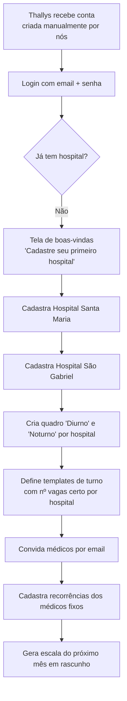
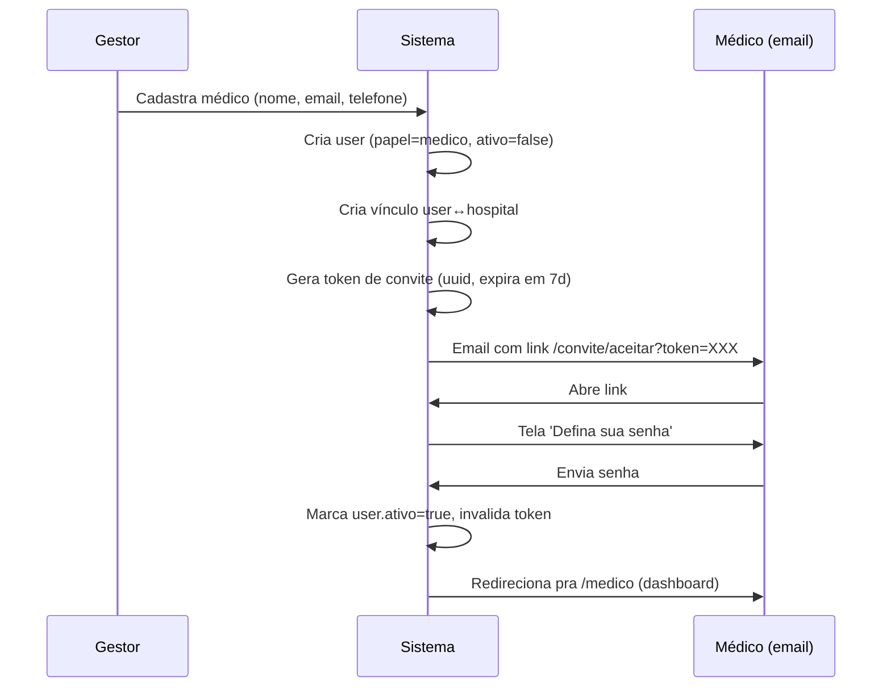
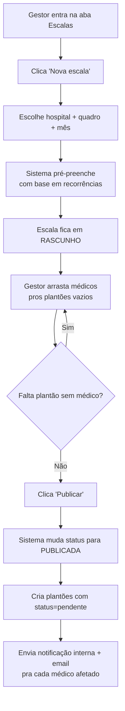
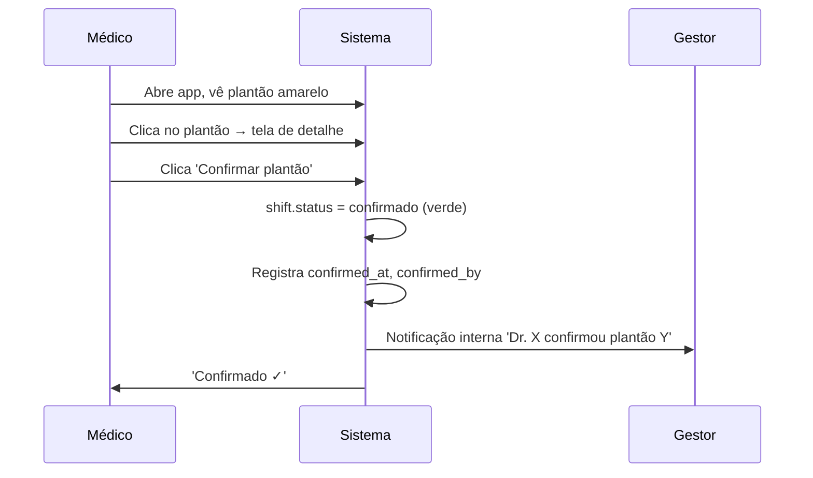
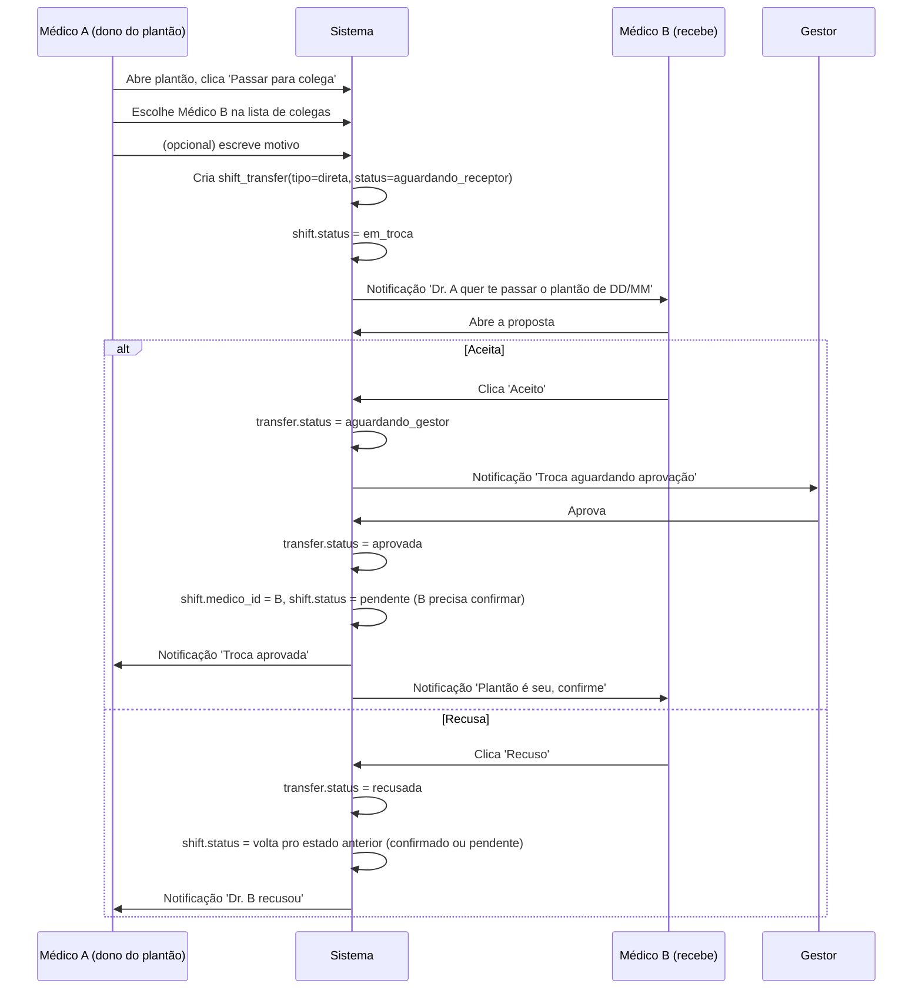
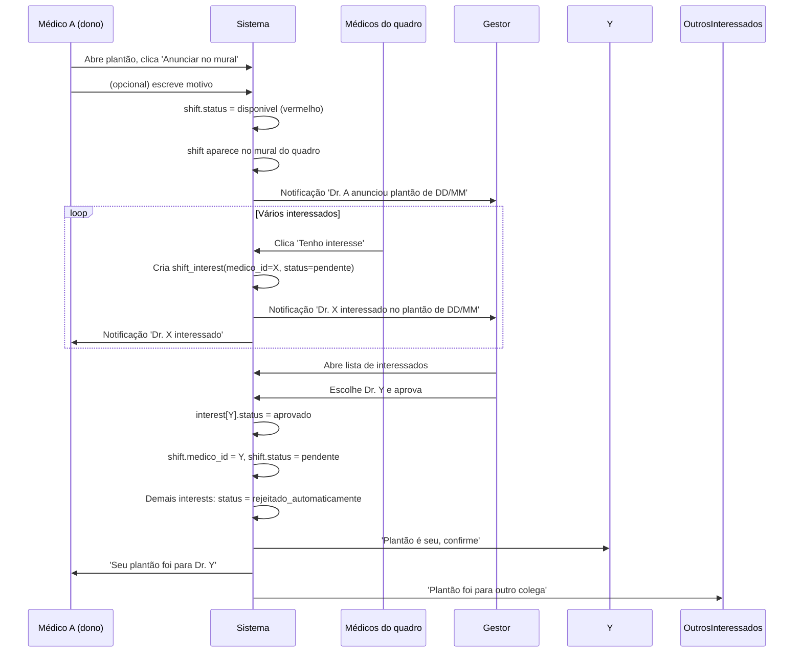
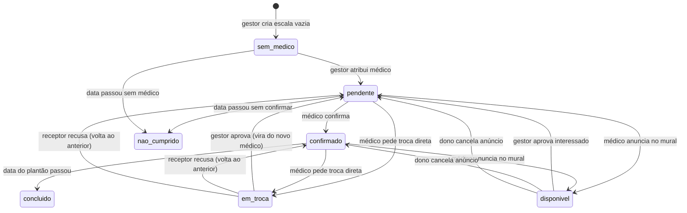

# 03 — Fluxos

Fluxos passo-a-passo com diagramas. Todo caminho crítico da v1.

---

## 1. Onboarding — Primeiro acesso do gestor

---

## 2. Convite de médico

**Regras:**
- Se email já existir na base, **não cria user novo** — só cria vínculo do user existente com o novo hospital
- Token válido por 7 dias, uso único
- Reenvio de convite gera novo token e invalida o anterior

---

## 3. Publicar escala mensal

**Detalhes:**
- Publicar é **irreversível** (não volta pra rascunho). Se precisa desfazer → cria nova versão.
- Cada plantão publicado nasce como `pendente` (amarelo) esperando confirmação do médico.
- Republicar (edição pós-publicação) só notifica os médicos afetados, não todos.

---

## 4. Médico confirma plantão

**Regras:**
- Confirmação é **ação explícita** — só visualizar NÃO confirma
- Pode confirmar até o início do plantão
- Depois de confirmado, pode disponibilizar/trocar (vai pro fluxo 5 ou 6)

---

## 5. Troca direta (médico → colega específico)

**Regras:**
- Médico A **só pode escolher** um Médico B que também atue naquele hospital
- Médico A pode **cancelar** a proposta antes de B responder
- Gestor pode **rejeitar** mesmo com B tendo aceitado (última palavra é dele)
- Rejeição do gestor: plantão volta pro A, B é notificado

---

## 6. Anúncio no mural (médico → qualquer)

**Regras:**
- Médico A **pode cancelar o anúncio** enquanto NENHUM interesse tiver sido aprovado
- Ao cancelar: plantão volta pro status anterior (confirmado ou pendente), interessados são notificados
- Múltiplos interessados é permitido — gestor decide
- Regra futura opcional: "primeiro que clicar leva sem gestor" — **NÃO no v1**

---

## 7. Ciclo de vida do plantão (visão macro)

**Estados finais** (não voltam):
- `concluido` — plantão feito
- `nao_cumprido` — deu ruim, precisa relatório

Formalizado em [06-regras-negocio.md](06-regras-negocio.md).
