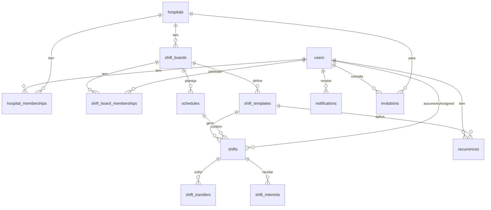

# 04 — Modelo de dados

Schema relacional. **Dev: SQLite** · **Prod: MySQL 8** (Postgres também serve) — Eloquent abstrai.

Nomenclatura: `snake_case` nas tabelas (convenção Laravel), models em PascalCase (`HospitalMembership`).

---

## Diagrama macro

---

## Tabelas

### `users`
Um humano só. Um médico que trabalha em 2 hospitais = 1 linha aqui.

| Campo | Tipo | Notas |
|---|---|---|
| id | uuid PK | |
| nome | text | |
| email | citext unique | login |
| senha_hash | text | argon2id ou bcrypt |
| telefone | text | E.164 (`+5581...`) |
| crm | text nullable | |
| crm_uf | text(2) nullable | |
| especialidade | text nullable | |
| ativo | boolean default true | soft-delete flag |
| ultimo_acesso | timestamptz nullable | |
| created_at | timestamptz | |
| updated_at | timestamptz | |

Não tem `papel` aqui — papel vive em `hospital_memberships`, porque um user pode ser gestor num hospital e médico em outro.

### `hospitals`
| Campo | Tipo | Notas |
|---|---|---|
| id | uuid PK | |
| nome | text | "Hospital Santa Maria" |
| cnpj | text nullable | não valida no v1 |
| endereco | text nullable | |
| telefone | text nullable | |
| ativo | boolean default true | |
| created_at | timestamptz | |
| updated_at | timestamptz | |

### `hospital_memberships`
Vínculo user↔hospital com papel.

| Campo | Tipo | Notas |
|---|---|---|
| id | uuid PK | |
| user_id | uuid FK users | |
| hospital_id | uuid FK hospitals | |
| papel | enum('gestor','medico') | |
| ativo | boolean default true | |
| created_at | timestamptz | |
| updated_at | timestamptz | |

Índice único: `(user_id, hospital_id, papel)`.

### `shift_boards`
Quadros de plantão dentro do hospital.

| Campo | Tipo | Notas |
|---|---|---|
| id | uuid PK | |
| hospital_id | uuid FK hospitals | |
| nome | text | "Diurno UTI" |
| descricao | text nullable | |
| cor | text nullable | hex opcional pra UI |
| ativo | boolean default true | |
| created_at | timestamptz | |
| updated_at | timestamptz | |

Índice: `(hospital_id, nome)` único.

### `shift_board_memberships`
Quais médicos participam de qual quadro. Só médicos deste vínculo veem/pegam plantões desse quadro.

| Campo | Tipo | Notas |
|---|---|---|
| id | uuid PK | |
| shift_board_id | uuid FK | |
| user_id | uuid FK | |
| created_at | timestamptz | |

Índice único: `(shift_board_id, user_id)`.

### `shift_templates`
Estrutura de turnos do quadro. "Todo sábado das 07 às 19, 2 vagas."

| Campo | Tipo | Notas |
|---|---|---|
| id | uuid PK | |
| shift_board_id | uuid FK | |
| dia_semana | smallint | 0=dom … 6=sáb |
| hora_inicio | time | ex: `07:00` |
| hora_fim | time | ex: `19:00` |
| atravessa_meia_noite | boolean | se `hora_fim <= hora_inicio` |
| vagas | smallint default 1 | 1 (Santa Maria) ou 2 (São Gabriel) |
| valor | numeric(10,2) nullable | valor padrão do plantão em R$ (ex: 1200.00) |
| rotulo | text nullable | "Diurno", "Madrugada" |
| ativo | boolean default true | |
| created_at | timestamptz | |
| updated_at | timestamptz | |

### `recurrences`
Médicos com padrão fixo (semanal ou quinzenal). Usado pra pré-preencher escala do mês.

| Campo | Tipo | Notas |
|---|---|---|
| id | uuid PK | |
| user_id | uuid FK users | o médico |
| shift_template_id | uuid FK | qual turno |
| tipo | enum('semanal','quinzenal') | |
| data_referencia | date | primeira ocorrência — define paridade da quinzena |
| ativo | boolean default true | |
| created_at | timestamptz | |
| updated_at | timestamptz | |

### `schedules`
Escala mensal.

| Campo | Tipo | Notas |
|---|---|---|
| id | uuid PK | |
| hospital_id | uuid FK | denormalizado pra query rápida |
| shift_board_id | uuid FK | |
| ano | smallint | |
| mes | smallint | 1-12 |
| status | enum('rascunho','publicada','cancelada','arquivada') | |
| versao | smallint default 1 | incrementa a cada republicação |
| publicada_em | timestamptz nullable | |
| criada_por | uuid FK users | |
| created_at | timestamptz | |
| updated_at | timestamptz | |

Índice único: `(shift_board_id, ano, mes)` — 1 escala por quadro/mês.

### `shifts`
Plantão individual. **A tabela mais importante.**

| Campo | Tipo | Notas |
|---|---|---|
| id | uuid PK | |
| schedule_id | uuid FK | |
| shift_template_id | uuid FK nullable | null se plantão avulso |
| hospital_id | uuid FK | denormalizado |
| shift_board_id | uuid FK | denormalizado |
| data | date | data-base do plantão |
| inicia_em | timestamptz | data + hora_inicio (com tz) |
| termina_em | timestamptz | data (+1 se atravessa MN) + hora_fim |
| medico_id | uuid FK users nullable | null = sem_medico |
| status | enum(ver [06-regras-negocio.md](06-regras-negocio.md)) | |
| valor | numeric(10,2) nullable | **snapshot** do valor — congelado na atribuição do médico; gestor pode editar individualmente |
| confirmado_em | timestamptz nullable | |
| observacao | text nullable | |
| origem | enum('manual','recorrencia') | |
| origem_recorrencia_id | uuid FK recurrences nullable | |
| created_at | timestamptz | |
| updated_at | timestamptz | |

Índices:
- `(medico_id, inicia_em)` — pra detectar conflito
- `(schedule_id, data)` — pra listar por dia
- `(status)` — pra filtrar mural etc.

### `shift_transfers`
Cobre tanto troca direta quanto anúncio no mural.

| Campo | Tipo | Notas |
|---|---|---|
| id | uuid PK | |
| shift_id | uuid FK | |
| tipo | enum('direta','mural') | |
| de_medico_id | uuid FK users | dono original |
| para_medico_id | uuid FK users nullable | preenchido só quando direta OU quando gestor aprova alguém do mural |
| motivo | text nullable | |
| status | enum('aguardando_receptor','aguardando_gestor','aprovada','recusada','cancelada','expirada') | |
| decidido_por | uuid FK users nullable | quem aprovou/rejeitou |
| decidido_em | timestamptz nullable | |
| created_at | timestamptz | |
| updated_at | timestamptz | |

Regra: só 1 transfer ativa (`aguardando_*`) por `shift_id`.

### `shift_interests`
Interessados quando o plantão está no mural (`tipo=mural` implícito).

| Campo | Tipo | Notas |
|---|---|---|
| id | uuid PK | |
| shift_id | uuid FK | |
| medico_id | uuid FK users | interessado |
| observacao | text nullable | |
| status | enum('pendente','aprovado','rejeitado','retirado','rejeitado_auto') | |
| decidido_por | uuid FK users nullable | |
| decidido_em | timestamptz nullable | |
| created_at | timestamptz | |
| updated_at | timestamptz | |

Índice único: `(shift_id, medico_id)` — 1 interesse por médico por plantão.

### `invitations`
Convites pendentes de médicos.

| Campo | Tipo | Notas |
|---|---|---|
| id | uuid PK | |
| hospital_id | uuid FK | |
| email | citext | |
| nome | text | |
| telefone | text nullable | |
| token_hash | text | sha256 do token do link (nunca guarda o token cru) |
| criado_por | uuid FK users | gestor que convidou |
| user_id | uuid FK users nullable | preenchido no aceite |
| status | enum('pendente','aceito','expirado','cancelado') | |
| expira_em | timestamptz | +7 dias |
| aceito_em | timestamptz nullable | |
| created_at | timestamptz | |
| updated_at | timestamptz | |

### `notifications`
Notificações internas.

| Campo | Tipo | Notas |
|---|---|---|
| id | uuid PK | |
| user_id | uuid FK users | destinatário |
| hospital_id | uuid FK nullable | escopo (null = global) |
| tipo | text | ex: `escala_publicada`, `troca_pendente`, `interesse_recebido` |
| titulo | text | |
| corpo | text | |
| link | text nullable | ex: `/gestor/trocas/123` |
| lida_em | timestamptz nullable | |
| created_at | timestamptz | |

Índice: `(user_id, lida_em, created_at desc)`.

### `password_resets`
Token pra "esqueci minha senha".

| Campo | Tipo | Notas |
|---|---|---|
| id | uuid PK | |
| user_id | uuid FK | |
| token_hash | text | |
| expira_em | timestamptz | +1h |
| usado_em | timestamptz nullable | |
| created_at | timestamptz | |

---

## O que **NÃO** tem no schema v1 (proposital)

- `audit_logs` — histórico completo com IP/user-agent → v2
- `notification_deliveries` — canal, provider, retry → v2 (junto com WhatsApp real)
- `platform_admins` — perfil global de super-admin → só quando virar SaaS
- Tabela separada de financeiro — **não precisa**: o faturamento é query de agregação sobre `shifts.valor` (por médico/mês/hospital). Recibo, NF e pagamento real → v2
- `feriados`, `escala_extra`, `plantao_fixo` (regra separada) — não precisa, `recurrences` cobre

---

## Contagem por hospital (só pra dimensionar)

- **Santa Maria**: 1 vaga × 2 turnos × 30 dias ≈ **60 plantões/mês**
- **São Gabriel**: 2 vagas × 2 turnos × 30 dias ≈ **120 plantões/mês**
- **Total**: ~180 shifts/mês → **~2.200/ano** — Postgres nem sente.

Com 100 médicos × ~2 plantões/semana em média ≈ ~800 shifts/mês real (mais realista, sobra folga).
